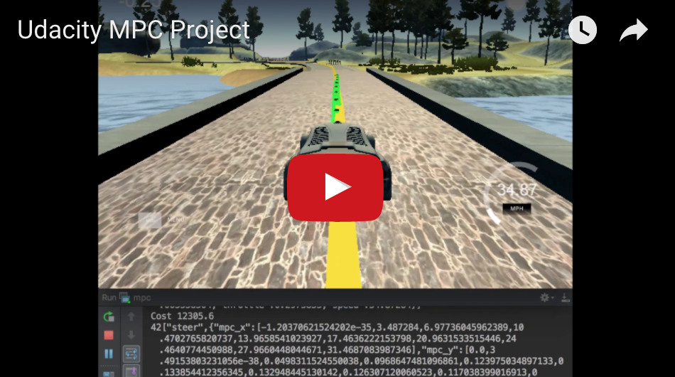

Udacity MPC Project 

Resulting Video:

[](https://www.youtube.com/watch?v=tej4i4EK94I)

**The Model**

Here we discuss in detail the model, including the state, actuator and update equations.

MPC stands for Model Predictive Control and it solves the task of finding a trajectory by optimization.  The resulting optimal solution is the optimal trajectory.  It first simulates the different control inputs to predict different possible solutions and then select the solution with minimal cost. 

Once the lowest cost trajectory were determined, the appropriate input is implemented for each step.  The rest of the calculated trajectory is thrown away as the new state will be used to calculate the new trajectory based on the input that was previously implemented. The input control is therefore constantly calculated based on the environment.  

The state vector includes:

* x: The car's x position 
* y: The car's y position
* psi: The orientation of the vehicle
* v: The current velocity
* delta: The current steering angle
* a: The current acceleration (throttle)

The control inputs:

* delta: steering angle
* a: acceleration (throttle)

Update equation:

* Xt1 = Xt + Vt * cos(psi) * dt
* Yt1 = Yt + Vt * sin(psi) * dt
* PSIt1 = PSIt + Vt / Lf * delta * dt
* Vt1 = Vt + At * dt

Here are the cost components related the reference state: cross-track error, orientation error and reference velocity.

```
        // The part of the cost based on the reference state.
        for (int t = 0; t < N; t++) {
            fg[0] += 100 * CppAD::pow(vars[cte_start + t], 2);
            fg[0] += CppAD::pow(vars[epsi_start + t], 2);
            fg[0] += CppAD::pow(vars[v_start + t] - ref_v, 2);
        }
```

Here are the cost components related to actuators: steering angle and acceleration.


```
        // Minimize the use of actuators.
        for (int t = 0; t < N - 1; t++) {
            fg[0] += 1000 * CppAD::pow(vars[delta_start + t], 2);
            fg[0] += 100 * CppAD::pow(vars[a_start + t], 2);
        }
```

Here are the cost components related to actuation changes between each step:

```
        // Minimize the value gap between sequential actuations.
        for (int t = 0; t < N - 2; t++) {
            fg[0] += 1000 * CppAD::pow(vars[delta_start + t + 1] - vars[delta_start + t], 2);
            fg[0] += CppAD::pow(vars[a_start + t + 1] - vars[a_start + t], 2);
        }
```

---


**Timestep Length and Elapsed Duration (N & dt)**

Here we discuss the reasoning behind the chosen N (timestep length) and dt (elapsed duration between timesteps) values were described. Additionally previous values tried is detailed below.

The prediction horizon T = N * dt is the duration over which future predictions are made.  N is the number of timesteps in the horizon and dt is the time between each actuation.  We would like to have T as large as possible so that we can have longer horizon.  We would like dt to be as small as possible so we don't wait for a long time before the next actuation.  

After several trial-and-errors with N = {25 30 35 20 15 10 5} and dt = {0.05 0.1 0.2}, I was satisified with the result performed at N=10 and dt=0.1, which results T=1.  The 0.1 for dt were preferred for it is the same as the latency.  

---


**Polynomial Fitting and MPC Preprocessing**

Prior to fitting the waypoints into a third degree polynomial, we convert the global positioned values into the car's coordinate.   

```
                    /*********************************************************************************
                     *
                     * Convert (ptsx, ptsy) waypoints from global coordinates to vehicle coordinate
                     *
                     *  ptsx (Array) - The global x positions of the waypoints.
                     *  ptsy (Array) - The global y positions of the waypoints.
                     *  x (float) - The global x position of the vehicle.
                     *  y (float) - The global y position of the vehicle.
                     *
                     *********************************************************************************/

                    int waypoint_size = ptsx.size();
                    Eigen::VectorXd ptsx_car(waypoint_size);
                    Eigen::VectorXd ptsy_car(waypoint_size);
                    for (int i = 0; i < waypoint_size; i++) {
                        double x_diff = ptsx[i] - px;
                        double y_diff = ptsy[i] - py;
                        ptsx_car[i] = x_diff * cos(psi) + y_diff * sin(psi);
                        ptsy_car[i] = y_diff * cos(psi) - x_diff * sin(psi);
                    }

                    /*********************************************************************************
                     * Fit a polynomial to the waypoints
                     *********************************************************************************/
                    auto coeffs = polyfit(ptsx_car, ptsy_car, 3);
                    // cout << "coeffs: "  << coeffs << endl;

```


---


**Model Predictive Control with Latency**

To compensate the latency, dt was selected as the same as the latency.  Also, the weighted averages of the last two delta and acceleration projections were used instead of just the most current one.  

```

    double delta = (solution.x[delta_start] + solution.x[delta_start+1] * 2) / 3;
    double a = (solution.x[a_start] + solution.x[a_start+1] * 2) / 3;


    vector<double> results = {delta, a};

    // std::cout << "solution: " << solution.x << endl;

    // attach the predicted route to display
    for (int i=0; i<N; i++) {
        results.push_back(solution.x[x_start+i]);
    }
    for (int i=0; i<N; i++) {
        results.push_back(solution.x[y_start+i]);
    }

    return results;
```

---

